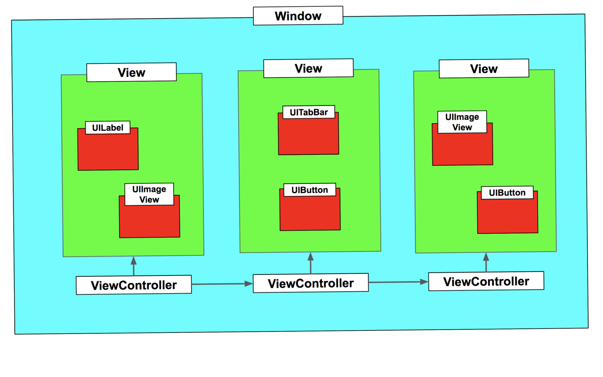

# Swift勉強会・文法編

## Swiftとは
Swiftとは、AppleのiOSおよびmacOS、Linuxで利用することのできるプログラミング言語で、iPhoneやiPadなどの端末やMacなどのPC向けのアプリを開発することができます。  
SwiftはXcodeを使って開発をします。RubyやPythonといったスクリプト言語の設計を取り入れているため、コーディングが楽にできます。  
型指定がないことや、セミコロンがいらないといったことが挙げられます。

## playgrounds
Swiftの動作やロジックを確認することのできる機能

# Swift文法
## Hello World

```swift
var str = "Hello, playground"
print(str) // Hello, playground

```

- print()  
print関数は標準出力に値を出力するグローバル関数です。引数は1つ以上指定することができます。異なる型の引数を指定することも可能です。キーワードseparator:をつけた文字列型の引数を渡すことで、複数表示する際の区切り文字を指定することができます。

```swift

print(2018,"4月",13,"(金)",separator:";") // 2018;4月;13;(金)

```

## 変数・定数

Swiftでは値を格納するために定数か変数であるかの定義を必ず行う必要があります。  
変数の場合はvarを、定数の場合はletを使用します。  
letは一度初期化されると変更できず、varは再代入できます。  
変更を意図しない場合は必ずletを使用します。

```swift
let str = "Swift"
var num = 11

num = 10
print(num) // 10

```


## 型宣言
Swiftでは型の指定は、let・varの右に変数名：型名で型宣言を行います。

```swift
 var str: String = "Hello World"
 var num: Int = 1234
 var num2: Float = 34.5
 var num3: Double = 1.234
 var flag: Bool = false

 print(str,type(of:str),separator:";") // Swift;String
 print(num,type(of:num),separator:";") // 11;Int

// 型推論
 var str1 = "Swift"
 var num1 = 10

// 暗黙の型変換は行われない
 let strnum = "666"
 let number = 10
 let number2 = 10.5
 number + strnum // 整数　＋　文字列
 number + number2 // 整数　＋　実数
```

- type(of:)  
引数で渡され値の型名を取得する関数です。キーワードof:をつけた引数に変数を渡すことで、型名を取得することができます。

上記の例ではstr1はString型、num1はInt型に推論されます。  
このためnumにInt型でないものを再代入することはできません。  
また暗黙の型変換は行われません。

| 種類 | 型名 | 説明 |
| ---- | ---- | ----
| 整数型 | Int | 整数全般に対する使用が推奨されている |
| 整数型 | UInt | 符号なし整数値 |
| 実数型 | Float |  浮動小数点数 |
| 実数型 | Double | 浮動小数点数 |
| 論理型 | Bool | リテラルでtrueかfalse |
| 文字 | Character | Unicodeの１文字 |
| 文字 | UnicodeScaler | Unicodeの文字コード |
| 文字列 | String | Unicodeの文字列 |

## 配列
配列に格納できるインスタンスの個数には制限がなく、自由に格納や取り出しができます。  
ただし、同一配列内は全て同じ型である必要があります。

```swift
// Int型の配列
let intArray = [1,2,3,4,5]
print(intArray[3]) // 4
// String型の配列
var stringArray = ["Swift","iOS","Xcode"]
print(stringArray[4]) // Fatal error: Index out of range

// 追加
stringArray.append("iPhone")
// 挿入
stringArray.insert("i0S11", atIndex: 1)
// 反転
stringArray.reverse()
// 取得
stringArray[0]
stringArray[0...2]
// 削除
stringArray.removeAtIndex(0)
stringArray.removeAll()

```

空の配列は次のように宣言できます。

```swift
var doubleArray: [Double] = []
var floatArray: Array<Float> = Array()
```

## 辞書型
数値や文字列をkeyにして、値を格納や参照を行うことができます。

```swift
// 辞書型の宣言
let dictionary: [String:Int] = ["Swift":4,"iOS":11,"Xcode":9]
// ValueにAnyを指定することで複数の型を格納できます
var dictionary2: [String:Any] = ["a":123,"b":"abc"]

// 値へのアクセス
let value = dictionary["iOS"]

// 値の更新
dictionary2["a"] = "Swift"

// 値の削除
dictionary["Xcode"] = nil

```

空の辞書型は次のように宣言できます。

```swift
var emptyDictionary: [String: Int] = [:]
```

## オプショナル型
Swiftでは空の状態であることをnilで表します。  
String型などの通常の型にはnilを保持することができません。  
オプショナル型にすることでnilを保持することができます。

オプショナル型とはデータ型の一種で、変数の宣言時に使用します。  
オプショナル型の特徴は変数にnilの代入を許すことです。  
Swiftではnilのオブジェクトに対して操作をすることで、アプリケーションが落ちてしまうため基本的にnilを許容しません。  
しかし、オプショナル型を使用することでnilを扱うことができます。  
変数にnilを代入することもできます。  

変数をオプショナル型として宣言するには、データ型の最後に"?"か"!"をつけます。  
型宣言以外で使用する"?"や"!"は、オプショナル型とは別の意味を持ちます。

```swift
// nilを代入できない
var a: String = nil
var b = nil
// オプショナル型の宣言
var hoge : String!
var fuga : Int?

var age: Int? 
print(age) // nil
age = 23
print(age) // Optional(23)
print(age!) // 23
```

### "?"と"!"の違いは
"?"も"!"もオプショナル型ですが、"!"は特に暗黙的アンラップ型と言われるオプショナル型です。  
アンラップとは日本語で開示といい、中身を取り出すという意味です。  

まずは一般的なオプショナル型"?"を見ていきます。

```swift
var a: Int? = 10
print(a) // Optional(10)

var b: Int = 10
a + b // Error
```

"?"で宣言したオプショナル型のInt型の変数と、普通のInt型では型が異なるため演算子で計算できません。  
そこでオプショナル型の値を通常の値に変換する、アンラップという処理が必要になります。  
そこで変数の後ろに"!"をつけることで通常の値に変換することができます。  
この"!"を用いたアンラップの方法を強制的アンラップと言います。  
オプショナル型の変数の中にどのような値が入っていても関係なく、その値を取り出します。  
強制的アンラップの記述は、オプショナル型の変数の後に"!"をつけます。  
（この"!"はオプショナル型の変数宣言時の"!"とは異なります）

```swift
a! + b // 20
```

アンラップする対象のオプショナル型がnilだった場合は、エラーとなります。  
そのため、アンラップする場合は必ずnil出ないことが保証されなければなりません。

一方の暗黙的アンラップ型"!"は"?"とは違い、使用する際は必ず強制的アンラップをすることです。使用する際に自動的にアンラップしてくれます。

```swift
var a: Int! = 10
var b: Int = 10

a + b // 20
```

暗黙的アンラップは同様に、変数がnilの場合はエラーが起きます。  
暗黙的アンラップは、最初はnilで宣言したいが、使用する際には値が必ず入っているような時に使用します。

```swift
// 値がnilの場合はエラーになります
var num1: Int?
var num2: Int!
let num: Int = 10

num1 + 10 //Error
num2 + 10 //Error
```

## for文
Swift3.0から単純なfor文の構文が使用できなくなり、for in を用いるようになりました。
```swift
 var num = 100
 // Swift3.0から書けなくなった
 for var i = 0; i <= 100 ; i++ {
     print(num)
 }
// 100以下
 for i in 1...num {
     print(i)
 }
// 100未満
 for i in 1..<num {
     print(i)
　}
// 辞書型のfor文
 let dictionary = ["Swift":4,"iOS":11,"Xcode":9]
 for (key,value) in dictionary {
     print("key",key,"value",value,separator:";")
 }
```

## if文
条件式の()はいりません。

```swift
 let num = 100
 if num >= 100 {
     print("true")
 } else {
     print("false")
 }
```

範囲を指定する場合は、caseを用いて書くこともできます。

```swift
if num >= 50 && num <= 100 {
    print("Ture")
}

if case 50 ... 100 = num {
    print("Ture")
}
```

# gaurd
guardは条件に一致なかった場合に、処理を中断させるための構文です。

例）文字列の配列内の要素を数値に変換し、変換できなかった場合は処理を中断

```swift
let stack = ["1","2","3","ab","cd"]
for str in stack{
    guard let v = Int(str) else {
        print(str + "??") // ab??
        break
    }
    print(v) // 1 2 3
}
```

条件式に記述した条件が成立しなかった場合にelse文が実行され、そのコードブロックから抜けます。  
else文の中には、必ず実行されるbreakやreturn、あるいは例外処理などのgurad文を含む実行中のコードブロックから抜け出す処理を記述しなければなりません。

先ほど説明したOptional型のアンラップする際によく使用されます。

```swift
func guardTest(num: Int?) {
    guard let unwrappedNum = num else { return }
    print(num) 
    print(unwrappedNum) 
}

guardTest(num:5)
guardTest(num:nil)
```


## 関数
Swiftの関数の定義の仕方は次のようになります。

```swift
 func 関数名(引数の変数名:引数の型) -> 戻り値の型 {

 }

 // 引数戻り値なし
func sample() {
}
 
// 引数あり
func sample(id :Int) {
}
 
// 戻り値あり
func sample() -> Bool }
  return true
}
 
// 引数・戻り値あり
func sample(name: String) -> String {
  return ""
}

```

## Extension
Swiftでは、すでに存在するクラス、構造体、列挙型、プロトコルに対して新しい機能を追加することができます。  
この機能を拡張（エクステンション）と呼びます。  
Swiftの文字列型には文字の長さを測るlengthプロパティがありません。

```swift

extension String {
    var length: Int {
        return self.characters.count
    }
}

let str = "Swift"
print(str,str.length)

```

# iOSアプリの構成

## CocoaTouch
iOSアプリはAppleが提供するCocoa Touchと呼ばれるフレームワーク群を利用して構成されています。  
Cocoa Touchの主要なフレームワークにFoundationとUIKitがあります。  
Foundationは文字列やコレクションといったプログラミング言語としての基本的なクラスから、並行処理やネットワーク処理のためのクラスまで、基本的なプログラミングの概念を提供するツールが揃っています。  
UIKitはユーザインタフェース機能を提供するフレームワークです。ボタンやラベル、テーブルなどのiOSのGUIでアプリケーションを構成するための重要な機能のほとんどを担っています。

## View
Viewはユーザーに画像やテキストなどを画面の表示を行うコンポーネントで、UIViewとそのサブクラスにあたります。  
Viewは複数のサブViewを持つことができ、Viewを重なり合わせて一つの画面を作成します。  
Viewのオブジェクトには、UIImageView（画像）、UITextView（テキスト）、UILable（ラベル）、UIButton（ボタン）などが提供されています。

## UIViewController
View ControllerはUIViewControllerのサブクラスで、自身が管理する一つのviewを持ちます。  
View Controllerは管理しているViewの更新と、そのviewで発生したイベントを受け取ってハンドリングを行っています。  
アプリの画面は、1つ以上のView Controllerで構成されていて、UIWindowが持つRootViewControllerに、必要に応じて複数のView Controllerが重なり、もしくは遷移してアプリの機能を提供しています。

## まとめ
iOSアプリは原則的に一つのウィンドウ（UIWindow)を持ち、その上に必要なViewを積み重ねていきます。  
ViewにはViewControllerによって直接管理されるものと、そのsubviewとして表示されるだけのView Controllerとは対応しないViewがあります。



# ハンズオンの予習

## UIImageView(UIKit)
UIImageViewクラスは、画面上に画像を表示する管理クラスです。  
画面上に画像を表示したいときに使用じます。
基本的な使い方は次のようになります。

```swift
// UIImageViewの生成
var uiImageView: UIImageView = UIImageView()

//imageViewの位置とサイズを設定
imageView.frame = CGRect(x: self.view.frame.width / 2 - 150, y: self.view.frame.height / 2 - 150, width: 300, height: 300)

//画像を生成。[fussan-blog.png]の部分は自分のアップロードした画像名に変更してね。
let image = UIImage(named:"画像名")!

//生成した画像をimageViewに設定
imageView.image = image

// UIImageViewにImageViewをセットする
self.view.addSubview(imageView)
```

- CGRect  
対象のオブジェクトの位置とサイズの両方を管理するクラスです。
生成するには位置（x座標、y座標）とサイズ（幅、高さ）を指定します。

- UIImage  
画像を管理するクラスです。背景に画像を表示したり、ボタンに画像を表示したりと、プログラム中で画像を扱う際に使用します。
画像ファイルを一度このオブジェクトにしてから、UIImageViewやUIButtonなどに渡す必要があります。

## UIPageViewController(UIKit)
画面遷移に使われるコントローラーの一つです。
複数のUIViewContorollerを並べて配置することができ、そのコントローラーをスワイプで遷移させることができます。

## UIPageViewControllerDataSource
ジェスチャーに応じて、UIPageViewControllerにViewControllerを提供するプロトコルです。
UIPageViewControllerクラスでページングを行う際に、スワイプの向きに合わせて表示するViewControllerを返します。
